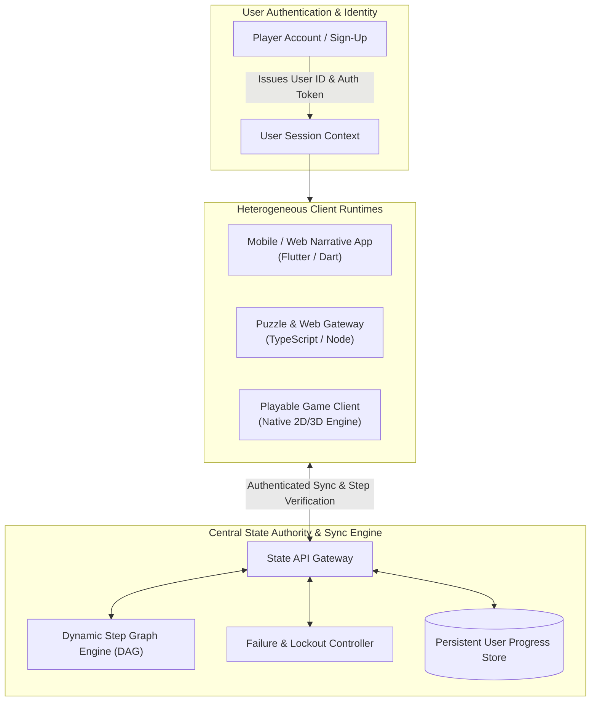
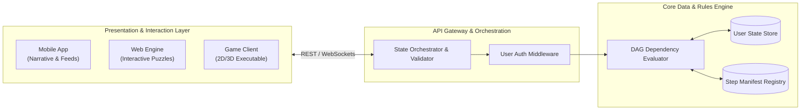
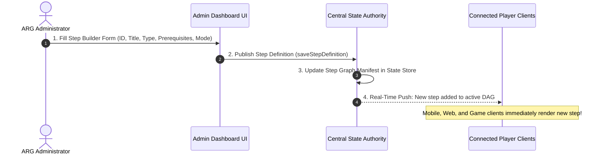
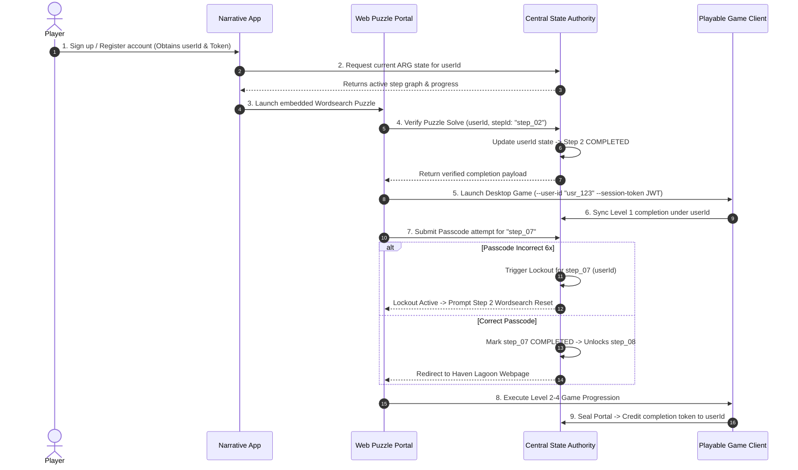
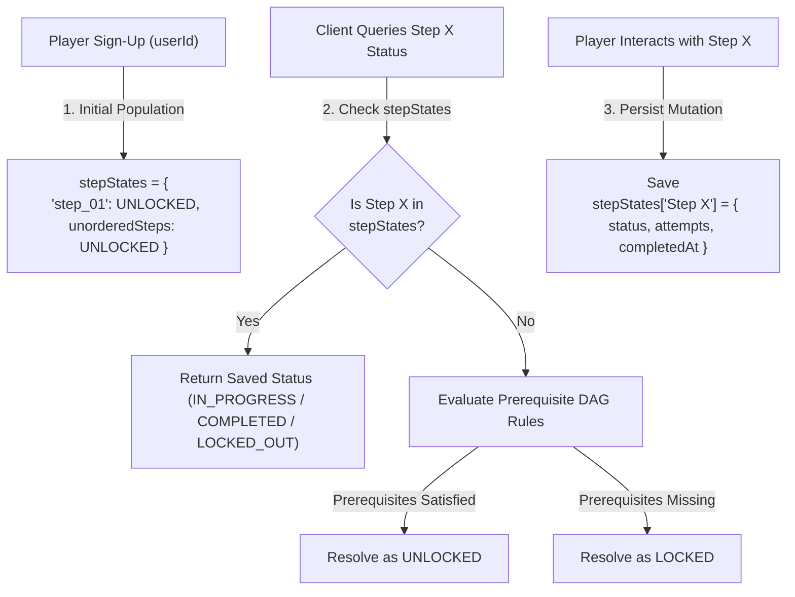
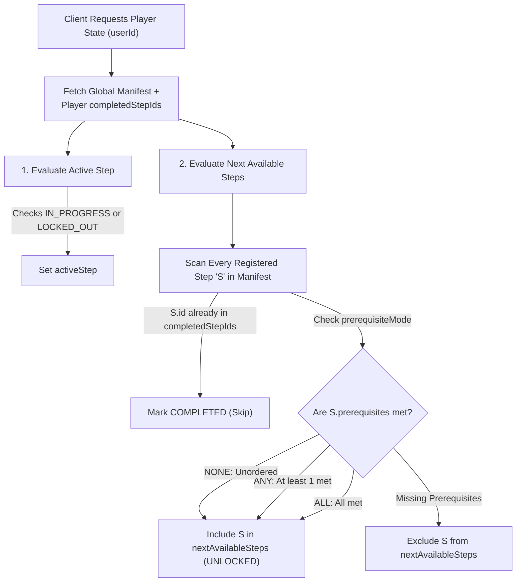

# Project Echo ARG — Distributed State Management Architecture
> **Executive Summary & Presentation Specification**  
> *A technology-agnostic blueprint for dynamic, multi-runtime, user-centric Alternate Reality Game (ARG) state orchestration.*

---

## 1. System Overview & Core Objectives

The **Project Echo ARG** is a multi-platform narrative experience that seamlessly weaves story clues, web puzzles, mobile feeds, and playable desktop game levels into an interactive 19+ step investigation loop.



### Core Design Principles
1. **User-Centric Persistence**: Player progress is anchored to a unique **`userId`** created during sign-up, enabling seamless multi-device play across mobile, web, and desktop.
2. **Dynamic Step Graph Engine**: Steps are governed by a data-driven **Directed Acyclic Graph (DAG)**. New steps (ordered, parallel, or unordered) can be added dynamically without code modifications or binary re-compilation.
3. **Multi-Runtime Interoperability**: Establishes a secure handoff protocol between web browsers, mobile viewports, and compiled game executables using HMAC-signed JWT tokens.
4. **No-Code Live Administration**: System administrators can create, re-order, or adjust step dependencies in real time via an interactive Admin Management Portal.

---

## 2. Dynamic Step Graph & State Schema

### 2.1 Technology-Agnostic State Schema

Instead of rigid, hardcoded progress flags, player progression is modeled as a dynamic key-value state tree bound to `userId`:

```typescript
type StepStatus = 'LOCKED' | 'UNLOCKED' | 'IN_PROGRESS' | 'COMPLETED' | 'LOCKED_OUT';

interface StepProgress {
  status: StepStatus;
  attempts: number;
  completedAt?: string;               // ISO 8601 timestamp
  customData?: Record<string, any>;   // Step-specific key-value store (passcodes, coordinates)
}

interface ArgPlayerState {
  userId: string;                     // Primary Key: Player User ID from registration
  username?: string;                  // Display handle
  currentActiveStepId: string;        // ID of active step
  completedStepIds: string[];         // List of completed step IDs (e.g. ["step_01", "step_02"])
  stepStates: Record<string, StepProgress>; // Dynamic progress map keyed by step ID
  inventory: string[];                // Cross-game inventory items
  metadata: Record<string, any>;       // Global player metadata & narrative flags
  lastUpdated: string;                // ISO 8601 timestamp
}
```

#### Step State Population & Initialization Strategy

To maximize efficiency and support zero-downtime additions of new steps, `stepStates` uses a **Lazy Hybrid Population Pattern**:

1. **Initial Sign-Up Population**:
   - Upon account registration, initial entry steps (`step_01`) and any unconditional unordered steps (`prerequisiteMode: 'NONE'`) are initialized in `stepStates` with `status: 'UNLOCKED'`.
2. **Dynamic Virtual Resolution for Unvisited Steps**:
   - Steps that have not yet been attempted by the player do not require static storage entries.
   - When a client queries step status, the Rule Engine evaluates `StepDefinition.prerequisites`:
     - Prerequisites satisfied -> Dynamically resolves to `UNLOCKED`.
     - Prerequisites unfulfilled -> Dynamically resolves to `LOCKED`.
3. **Persisted Mutations on Interaction**:
   - As soon as a player interacts with a step (submits passcodes, increments attempt counters, encounters a lockout, or completes a step), an explicit `StepProgress` record is saved to `stepStates[stepId]`.
4. **Admin UI Additions**:
   - When an administrator publishes a new step via the Admin Portal, **no database migration is needed** for existing players. The DAG engine automatically resolves access for all users based on their existing `completedStepIds`.
5. **On-Demand Lazy Initialization**:
   - On first API request (`/blog-api/player/state`), if an existing Auth0 user (e.g. team member) does not have an `ArgPlayerState` document, the server creates default state with `step_01_blog` marked as `UNLOCKED` without requiring database migration scripts.


---

### 2.2 Flexible Step Pipeline Definition

Steps are configured as lightweight metadata records supporting **linear**, **parallel**, or **unordered** interaction patterns:

```typescript
type StepType = 'READ' | 'PUZZLE' | 'PASSCODE' | 'GAME_LEVEL' | 'EXTERNAL_LINK' | 'CUSTOM';
type PrerequisiteMode = 'ALL' | 'ANY' | 'NONE';

interface StepDefinition {
  id: string;                        // Unique identifier (Semantic Slug e.g., "step_01_blog", "step_07_passcode")
  order: number;                     // Visual display / default sorting index
  type: StepType;                    // Interaction pattern
  title: string;                     // Human-readable step title
  isUnordered: boolean;              // If true, accessible anytime once unlocked
  isDeleted?: boolean;               // Soft-delete flag (default: false)
  deletedAt?: string;                // ISO timestamp when step was soft-deleted
  prerequisites: string[];           // Dependent step IDs required for unlocking
  prerequisiteMode: PrerequisiteMode;// 'ALL' = AND logic, 'ANY' = OR logic, 'NONE' = Unconditional access
  lockoutPolicy?: {
    maxAttempts: number;             // Maximum allowed attempts before lockout (e.g., 6)
    resetPrerequisiteStepId: string; // Step ID whose re-completion clears lockout (e.g., "step_02_wordsearch")
  };
  unlockPayload?: Record<string, any>; // Dynamic payload revealed on unlock (URLs, scene paths, codes)
}
```

#### Prerequisite Evaluation Modes:
- **`'NONE'` (Unordered Step)**: No prerequisites required. Available to players immediately at any time.
- **`'ANY'` (Branching / Parallel Paths)**: Completing *any single* prerequisite step unlocks access.
- **`'ALL'` (Sequential Convergence)**: Requires *all* prerequisite steps to be completed before unlocking.

---

### 2.3 Client Step Discovery & Progression Resolution

Client runtimes do not hardcode sequence logic; instead, they query the **Central State Authority** for a calculated **Progress Projection Payload** computed dynamically for the player's `userId`.

#### 1. Dynamic Progress Projection Payload
When a client boots or a step transition occurs, the server evaluates `StepDefinition` rules against `completedStepIds` and returns:

```json
{
  "userId": "usr_99812a",
  "activeStep": {
    "id": "step_07_passcode",
    "title": "Blog Input Passcode Block",
    "type": "PASSCODE",
    "status": "IN_PROGRESS",
    "attempts": 2,
    "maxAttempts": 6,
    "lockoutResetStepId": "step_02_wordsearch"
  },
  "completedStepIds": ["step_01_blog", "step_02_wordsearch", "step_03_website", "step_04_level1", "step_05_ascii_hints", "step_06_ascii_post"],
  "nextAvailableSteps": [
    {
      "id": "step_07_passcode",
      "type": "PASSCODE",
      "title": "Blog Input Passcode Block",
      "status": "UNLOCKED"
    },
    {
      "id": "step_20_side_quest",
      "type": "GAME_LEVEL",
      "title": "Optional Hub Monolith",
      "status": "UNLOCKED",
      "isUnordered": true
    }
  ],
  "unlockedPayloads": {
    "step_06_ascii_post": {
      "url": "https://blog.echo.org/posts/missing_files"
    }
  }
}
```

#### 2. How the Server Computes `activeStep` and `nextAvailableSteps`

1. **Current / Active Step Determination**:
   - The server identifies the primary active step by finding the latest uncompleted step in sequence or any step explicitly in `IN_PROGRESS` or `LOCKED_OUT` status.
   - If `step_07` is locked out after 6 failed attempts, `activeStep.status` returns `LOCKED_OUT` and directs the client to re-solve `step_02_wordsearch`.
2. **Next Available Steps Evaluation**:
   - The Rule Engine iterates through all registered steps `S` in the manifest:
     - If `S.id` is already in `completedStepIds`, it is marked `COMPLETED`.
     - If `S.prerequisiteMode` conditions (`NONE`, `ANY`, or `ALL`) are met against `completedStepIds`, `S` is appended to `nextAvailableSteps` with `status: 'UNLOCKED'`.

#### 3. Subsystem UI Resolution
- **Flutter Narrative App**: Renders blog cards and interactive widgets dynamically based on `completedStepIds` and `nextAvailableSteps`.
- **Web Puzzle Engine**: Upon POSTing to `/api/step/verify`, immediately receives the updated `nextAvailableSteps` array and `unlockPayload` (e.g. redirect URL or Godot scene name) to trigger UI transitions.
- **Godot Game Client**: `GameState.gd` checks `can_access_step(step_id)` or `is_step_completed(step_id)` against the projection payload to unlock scene portals, chest interactions, and NPC dialogue branches.

---


---

## 3. Subsystem Architecture & Responsibilities



### 1. Central State Authority & Data Layer
- **Single Source of Truth**: Houses user progress (`ArgPlayerState`) and step manifests (`StepDefinition`).
- **DAG Rule Engine**: Dynamically evaluates prerequisite modes (`ALL`, `ANY`, `NONE`) when clients query step availability.
- **Lockout & Failure Controller**: Tracks failed passcode/puzzle attempts per user and issues reset triggers upon prerequisite re-solve events.

### 2. Mobile & Narrative Client (Flutter)
- Manages user login and session tokens.
- Dynamically renders blog posts, audio feeds, and embedded puzzles based on unlocked steps pushed from the backend.

### 3. Web & Puzzle Engine
- Processes puzzle submissions and passcode inputs (`/api/step/verify`).
- Generates cryptographically signed redirect tokens for seamless client handoffs.

### 4. Playable Game Client (Native Engine)
- Accepts `--user-id` and `--session-token` command-line launch parameters.
- Communicates back to the Central State Authority via background HTTP requests as the player explores levels, solves switches, and seals portals.

---

## 4. Admin Management & Live Expansion

New ARG steps can be authored and published **in real-time** via an interactive Admin Management Portal without code deployments:



---

## 5. End-to-End Player Lifecycle Flow


---
  ### How stepStates Population Works


---
  ### How the Server Computes Current & Next Steps

---