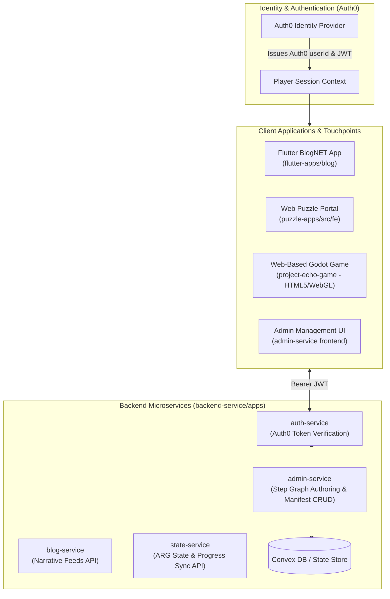

# Project Echo ARG — End-to-End Implementation Plan

This document details the technical implementation roadmap for the Project Echo ARG State Management Architecture, fully aligned with **Auth0 Authentication**, **Web-Based Godot Game Integration**, and the **`admin-service` Microservice Platform** located in `backend-service/apps`.

---

## 1. System Architecture & Environment Mapping

---

## 2. Technical Stack & Service Assignments

| Module | Location | Technology Stack | Responsibility |
| :--- | :--- | :--- | :--- |
| **Identity Provider** | Auth0 Cloud | Auth0 OIDC / JWT | User signup, login, issuing `userId` (`sub`) and bearer JWTs across all client platforms. |
| **Admin Service** | `backend-service/apps/admin-service` | Fastify / TypeScript | Houses administrative APIs for creating, editing, and publishing step definitions live. |
| **Auth Service** | `backend-service/apps/auth-service` | Fastify / Auth0 SDK | Middleware for validating Auth0 JWT tokens and user claims. |
| **Blog Service** | `backend-service/apps/blog-service` | Fastify / Flutter | Renders narrative feeds, notebook scans, and active step cards on BlogNET. |
| **State Service** | `backend-service/apps/state-service` | Fastify / TypeScript | New standalone microservice for ARG state, dynamic DAG step graph evaluation, and progress sync. |
| **Game Service** | `backend-service/apps/game-service` | Fastify / Godot | Preserved for future non-ARG game features (3D physics telemetry, leaderboards, mini-games). |

| **Puzzle Engine** | `puzzle-apps` | Express / TypeScript | Evaluates Wordsearch puzzles and processes passcode submissions (`NHW`). |
| **State Database** | `puzzle-apps/src/services/convex` | Convex DB | Persistent storage for `stepDefinitions` and `argPlayerStates` indexed by Auth0 `userId`. |
| **Playable Game** | `project-echo-game` | Godot 4 (HTML5/WebGL) | Playable web levels 1–4, Auth0 sign-in bridge, and progress state HTTP syncing. |

---

## 3. Phased Implementation Roadmap

### Phase 1: Database Schemas, Convex Integration & Manifest Seed ([puzzle-apps/src/services/convex](file:///C:/Users/crayton.mfune/Documents/projects/techacc/puzzle-apps/src/services/convex))
- [ ] Seed live Convex DB tables with initial reference datasets:
  - Run Convex seed script (`npx convex run seed`) to load `dictionaryData.json`, `redirectUrlData.json`, and `backend-service/apps/state-service/config/arg_steps_manifest.json` into live Convex collections (`dictionary`, `redirectUrls`, `stepDefinitions`).

- [ ] Refactor [ConvexService.ts](file:///C:/Users/crayton.mfune/Documents/projects/techacc/puzzle-apps/src/services/convex/ConvexService.ts):
  - Wire `ConvexHttpClient` directly to live `CONVEX_URL` environment variable.
  - Remove local mock maps (`mockPuzzles`, `mockRedirectUrls`, `mockDictionary`) and fallback JSON reading logic so `puzzle-apps` operates entirely against the live Convex database.
  - Expose live query/mutation methods for `stepDefinitions` and `argPlayerStates`.
- [ ] Implement DAG Prerequisite Evaluator in `ConvexService.ts`:
  - `getOrCreatePlayerState(userId)`: Dynamically initializes `ArgPlayerState` for existing Auth0 users on their first request without requiring database migration scripts.
  - `canUnlock(userId, stepId)`: Evaluates `prerequisiteMode` (`ALL`, `ANY`, `NONE`) against `completedStepIds`.
  - `getProjectionPayload(userId)`: Computes `activeStep`, `completedStepIds`, and `nextAvailableSteps`.
  - `completeStep(userId, stepId, payload)`: Marks step completed and clears linked lockouts.
  - `recordFailure(userId, stepId)`: Increments attempt counter and sets `LOCKED_OUT` status on 6th failed attempt.
- [ ] Create `state-service` as a new standalone Fastify microservice in `backend-service/apps/state-service` (preserving `game-service` for future game feature development):
  - `GET /state-api/player/state`: Returns progress projection payload (`activeStep`, `completedStepIds`, `nextAvailableSteps`).
  - `POST /state-api/player/step/complete`: Validates step completion and returns updated payload.
  - `POST /state-api/player/step/fail`: Records failed passcode/puzzle attempts and triggers lockout if max attempts reached.

---

### Phase 2: Auth0 Middleware & Token Validation (`backend-service/apps/auth-service`)
- [ ] Configure Auth0 domain, client ID, and API audience parameters.
- [ ] Implement Auth0 JWT verification middleware in `auth-service`:
  - Validates `Authorization: Bearer <Auth0_JWT>` header on incoming HTTP requests.
  - Extracts Auth0 `userId` (`sub`) and attaches user scope to request context.
  - Verifies `admin` role claims for requests targeting `admin-service`.

---

### Phase 3: Admin Microservice Integration (`backend-service/apps/admin-service`)
- [ ] Add Step Management API routes in `admin-service` (`src/modules/apis/apis.routes.ts`):
  - `GET /blog-api/admin/steps`: Returns all registered `StepDefinition` records (including soft-deleted steps for admins).
  - `POST /blog-api/admin/steps`: Creates a new step definition.
  - `PUT /blog-api/admin/steps/:id`: Updates an existing step definition (title, prerequisites, lockout policy, payloads).
  - `DELETE /blog-api/admin/steps/:id`: **Soft-deletes** a step by setting `isDeleted: true` and `deletedAt: timestamp`.
  - `PATCH /blog-api/admin/steps/:id/restore`: Restores a soft-deleted step (`isDeleted: false`).
- [ ] Connect `admin-service` routes to `ConvexService.ts` mutations (`saveStepDefinition`, `softDeleteStepDefinition`, `restoreStepDefinition`).
- [ ] Update DAG Engine in `state-service`: Soft-deleted steps are bypassed in prerequisite calculations so downstream progression is never blocked.

---

### Phase 4: Flutter BlogNET Auth0 Integration (`flutter-apps/blog`)
- [ ] Add `flutter_auth0` package dependency in `pubspec.yaml`.
- [ ] Update sign-up / log-in flow in [main.dart](file:///C:/Users/crayton.mfune/Documents/projects/techacc/flutter-apps/blog/lib/main.dart) to authenticate via Auth0.
- [ ] Implement `ArgStateNotifier` (Provider/Riverpod state manager):
  - Fetches `/state-api/player/state` on app launch with Auth0 bearer token.
  - Subscribes to dynamic progress projection payload (`nextAvailableSteps`).
- [ ] Dynamically render blog post cards, embedded puzzle links, and passcode input fields based on active/unlocked steps.

---

### Phase 5: Web Puzzle Engine & Passcode Controller (`puzzle-apps`)
- [ ] Update [routes/api.ts](file:///C:/Users/crayton.mfune/Documents/projects/techacc/puzzle-apps/src/routes/api.ts) to require Auth0 token verification.
- [ ] Refactor `/api/step/verify` endpoint:
  - Validates passcode inputs (e.g. `NHW` for `step_07_passcode`).
  - Calls `ConvexService.completeStep(userId, stepId)` and returns updated `nextAvailableSteps` + `unlockPayload`.
  - Enforces Step 7 lockout policy (6 failed attempts -> locks passcode input -> requires re-solving Step 2 Wordsearch in [WordSearchService.ts](file:///C:/Users/crayton.mfune/Documents/projects/techacc/puzzle-apps/src/services/word-search/WordSearchService.ts) to clear).

---

### Phase 6: Web-Based Godot Game Auth0 Integration (`project-echo-game`)
- [ ] Configure Godot WebGL HTML5 export template for browser deployment.
- [ ] Implement JavaScript-to-GDScript bridge in Game Website landing page:
  - Player signs in via Auth0 on the Game Website.
  - JS bridge passes Auth0 `userId` and bearer token into Godot WebGL runtime instance via JavaScript interface.
- [ ] Update `GameState.gd` Autoload singleton:
  - Initializes user session using Auth0 credentials.
  - Sends background `HTTPRequest` calls to `state-service` upon level completion, discovering chest logs in Level 2, booting mainframe terminal in Level 3, and sealing portal in Level 4.
  - Evaluates dialogue tree conditions in [greet.dialogue](file:///C:/Users/crayton.mfune/Documents/projects/techacc/project-echo-game/dialogue/greet.dialogue) (`if GameState.is_step_completed("step_04_level1")`).

---

### Phase 7: End-to-End Verification & Integration Testing
- [ ] Perform full 19-step playthrough verification across BlogNET, Web Puzzles, and HTML5 Godot Game.
- [ ] Test Auth0 session persistence across mobile and web viewports.
- [ ] Test Step 7 lockout loop (6 failed attempts -> lockout -> Wordsearch solve -> lockout reset).
- [ ] Test live step authoring in `admin-service` (add `step_20_secret` -> verify active WebGL game and BlogNET app receive update live).

---

## 4. Key Implementation Decisions Confirmed

| Architectural Requirement | Confirmed Implementation Choice |
| :--- | :--- |
| **Authentication** | **Auth0**: Centralized identity issuing `userId` (`sub`) and bearer JWTs across Flutter, Web, and Godot. |
| **Game Client Runtime** | **Web-Based Godot Game (WebGL / HTML5)**: Hosted on the Game Website where players log in via Auth0 directly. |
| **Admin Management Service** | **`admin-service`**: Microservice in `backend-service/apps/admin-service` executing step definition CRUD operations. |
| **Step Identifier Format** | **Immutable Semantic Slugs**: e.g., `step_01_blog`, `step_07_passcode`, `step_19_onion_qr`. |
| **Step State Storage** | **Lazy Hybrid Population**: Initial starting steps stored on signup; unvisited steps resolved virtually via DAG engine. |
