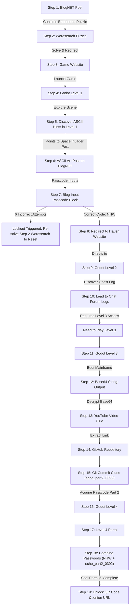
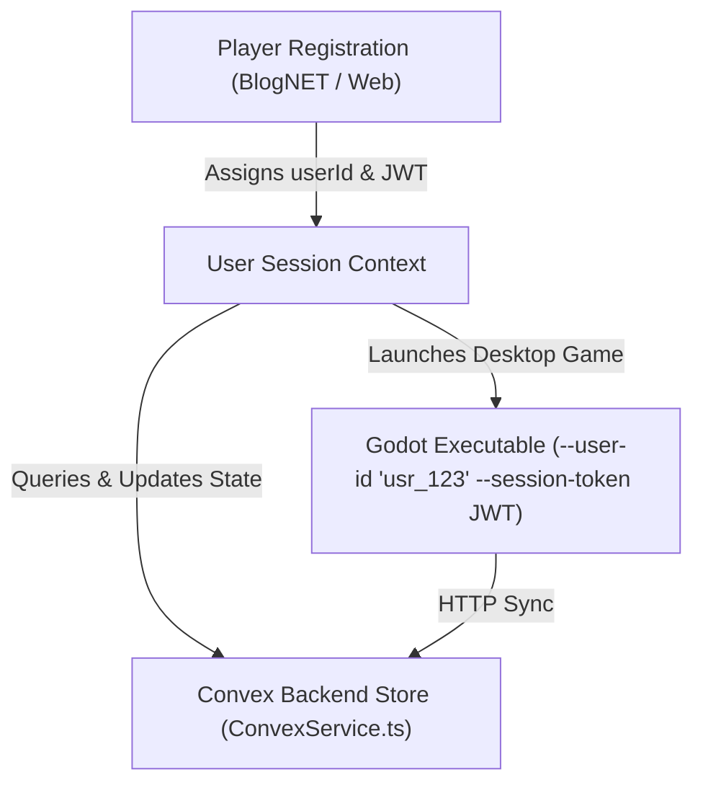

# Project Echo ARG Integration Blueprint & State Management

This document serves as the official technical specification for the **Project Echo ARG**, detailing the 19-step gameplay pipeline, historical artifact mappings, and system-level state management architecture.

---

## 1. The Interwoven ARG Pipeline



---

## 2. Artifact Integration Matrix

This matrix maps recovered investigation items from `extracted_artifacts.md` directly into the ARG pipeline:

| Step | ARG Action / Phase | Incorporated Artifact | Gameplay & Narrative Integration |
| :--- | :--- | :--- | :--- |
| **Step 1** | **BlogNET Post** | *Recovered Notebook Pages (2026-03-01)* | Initial blog post on [main.dart](file:///C:/Users/crayton.mfune/Documents/projects/techacc/flutter-apps/blog/lib/main.dart) displays Cedric's scanned notebook page revealing a hidden grid. |
| **Step 2** | **Wordsearch Puzzle** | *Recovered Notebook Page (2026-07-07)* & *Tetris (2003-01-10)* | Interactive puzzle generated via [WordSearchService.ts](file:///C:/Users/crayton.mfune/Documents/projects/techacc/puzzle-apps/src/services/word-search/WordSearchService.ts) using Tetris block grid coordinates. |
| **Step 3** | **Game Web Portal** | *Game Landing Page & Download Portal* | Solving the wordsearch redirects players to the main Game Download Portal. |
| **Step 4** | **Godot Level 1** | *Catalogued Collection (2007-04-29)* & *Map Offsets (2003-05-02)* | NPC Blacksmith dialogue in [greet.dialogue](file:///C:/Users/crayton.mfune/Documents/projects/techacc/project-echo-game/dialogue/greet.dialogue) and player inventory in [player_josh.gd](file:///C:/Users/crayton.mfune/Documents/projects/techacc/project-echo-game/character/player_josh.gd) mirror archive spreadsheets. |
| **Step 5** | **Discover ASCII Hints** | *Cedric's Route Recreation (2024-01-01)* | Level 1 monolith coordinates match offsets documented in Cedric's archive post. |
| **Step 6** | **ASCII Art Post** | *Echo Missing Files (2003-06-20)* | Grim Reaper ASCII image presented as visual reconstruction of missing file `Screenshot_024.png`. |
| **Step 7** | **Blog Input Passcode** | *Decoded Notebook URL (2026-05-01)* | Entering passcode `NHW` in [api.ts](file:///C:/Users/crayton.mfune/Documents/projects/techacc/puzzle-apps/src/routes/api.ts) decrypts the ROT13 lagoon URL. |
| **Step 8** | **Haven Website Redirect** | *Map Offsets & Dialogue (2003-05-02)* | Decrypted URL redirects player to the unlisted 2003 Haven Lagoon website (`unlisted_lagoon.html`). |
| **Step 9** | **Godot Level 2** | *Investigation Update (2003-08-08)* | Level 2 bridges and water currents replicate map file `HAVEN_MAP_03.png`. |
| **Step 10** | **Lead to Chat Forum** | *Dialogue Logs (2003-05-02)* | Chest in Level 2 contains chat log records between Cedric and Haven's owner. |
| **Step 11** | **Godot Level 3** | *Patterns In The World (2003-05-16)* | Generator breaker switches require coordinate patterns documented in Cedric's notes. |
| **Step 12** | **Base64 Decryption** | *Indexing Cedric's Archive (2023-07-01)* | Level 3 mainframe terminal outputs corrupted Base64 index string. |
| **Step 15** | **Git Commit Clue** | *Investigation Timeline (2026-07-06)* | Git commit history walk yields passcode part 2 (`echo_part2_0392`). |
| **Step 16 & 17** | **Level 4 & Portal** | *Preparing Final Route (2003-07-18)* | Level 4 platforming path and combined console match Cedric's final route sketches. |
| **Step 18** | **Combine Passcodes** | *Combined Code Mechanics* | Terminal console combines ASCII code (`NHW`) and Git commit code (`echo_part2_0392`). |
| **Step 19** | **QR & Onion Link** | *Community Tracker (2026-08-01)* | Sealing portal triggers completion in [ConvexService.ts](file:///C:/Users/crayton.mfune/Documents/projects/techacc/puzzle-apps/src/services/convex/ConvexService.ts), logging token to the community database. |

---

## 3. Implementation State Architecture (Convex & Runtimes)

### 3.1 Overview & Technical Stack
The system coordinates state across three primary runtime environments:
1. **Flutter App (`flutter-apps/blog`)**: Renders narrative blog posts, notebook page scans, and public updates.
2. **TypeScript / Node Web Service (`puzzle-apps`)**: Handles puzzle verification ([WordSearchService.ts](file:///C:/Users/crayton.mfune/Documents/projects/techacc/puzzle-apps/src/services/word-search/WordSearchService.ts)), API validation ([routes/api.ts](file:///C:/Users/crayton.mfune/Documents/projects/techacc/puzzle-apps/src/routes/api.ts)), and Convex backend sync ([ConvexService.ts](file:///C:/Users/crayton.mfune/Documents/projects/techacc/puzzle-apps/src/services/convex/ConvexService.ts)).
3. **Godot Game Engine (`project-echo-game`)**: Executes playable desktop levels (Levels 1–4), player movement ([player_josh.gd](file:///C:/Users/crayton.mfune/Documents/projects/techacc/project-echo-game/character/player_josh.gd)), dialogue trees ([greet.dialogue](file:///C:/Users/crayton.mfune/Documents/projects/techacc/project-echo-game/dialogue/greet.dialogue)), interactive chests, and portal sealing.

---

### 3.2 Extensible Step Registry & User State Schema

#### Manifest Step Definition (`StepDefinition`)
```typescript
type StepType = 'READ' | 'PUZZLE' | 'PASSCODE' | 'GAME_LEVEL' | 'EXTERNAL_LINK' | 'CUSTOM';
type PrerequisiteMode = 'ALL' | 'ANY' | 'NONE';

interface StepDefinition {
  id: string;                        // Unique identifier (Semantic Slug e.g. "step_01_blog", "step_07_passcode")
  order: number;                     // Sorting index
  type: StepType;                    // Interaction pattern
  title: string;                     // Human-readable title
  isUnordered: boolean;              // Accessible anytime if true
  isDeleted?: boolean;               // Soft delete flag (default: false)
  deletedAt?: string;                // ISO timestamp when step was soft-deleted
  prerequisites: string[];           // Dependent step IDs
  prerequisiteMode: PrerequisiteMode;// 'ALL' = AND logic, 'ANY' = OR logic, 'NONE' = Unordered
  lockoutPolicy?: {
    maxAttempts: number;             // Maximum allowed attempts before lockout (e.g. 6)
    resetPrerequisiteStepId: string; // Step ID whose re-completion clears lockout (e.g. "step_02_wordsearch")
  };
  unlockPayload?: Record<string, any>; // Data revealed on unlock (URLs, scene paths, codes)
}
```

#### Step Identifier Format: Semantic Slugs vs. UUIDs
**Recommendation: Use Immutable Human-Readable Semantic Slugs (`"step_01_blog"`, `"step_04_level1"`), NOT UUIDs.**
- **GDScript & Dialogue Simplicity**: Game code and dialogue trees can directly write `GameState.is_step_completed("step_04_level1")` without dealing with obscure 36-character UUID strings (`"f47ac10b-58cc-4372-a567-0e02b2c3d479"`).
- **Narrative Content Creation**: Story writers and puzzle designers can author step prerequisites in JSON manifests without copy-paste errors.
- **Log Inspectability**: Debugging server logs and database records (`completedStepIds: ["step_01_blog", "step_02_wordsearch"]`) provides instant context.


#### User Player State Schema (`ArgPlayerState`)
```typescript
type StepStatus = 'LOCKED' | 'UNLOCKED' | 'IN_PROGRESS' | 'COMPLETED' | 'LOCKED_OUT';

interface StepProgress {
  status: StepStatus;
  attempts: number;
  completedAt?: string;
  customData?: Record<string, any>;
}

interface ArgPlayerState {
  userId: string;                     // Primary Key: User ID from sign-up
  username?: string;                  // Player display handle
  currentActiveStepId: string;        // Primary active step ID
  completedStepIds: string[];         // List of completed step IDs
  stepStates: Record<string, StepProgress>; // Progress map per step ID
  inventory: string[];                // Shared cross-game inventory
  metadata: Record<string, any>;       // Global flags & variables
  lastUpdated: string;                // ISO 8601 timestamp
}
```

#### Step State Population Strategy (Initial vs Dynamic Resolution)
- **Initial Registration**: When a new `userId` is created, `stepStates` is initialized only with active entry points (e.g. `step_01` and any unordered steps with `prerequisiteMode: 'NONE'`) marked as `UNLOCKED`.
- **Lazy Virtual Resolution**: Unvisited steps do not require pre-populated database rows. When queried, the DAG engine dynamically evaluates `StepDefinition.prerequisites` against `completedStepIds`:
  - If prerequisites are satisfied -> resolves to `UNLOCKED`.
  - If prerequisites are missing -> resolves to `LOCKED`.
- **Persisted State Mutations**: Once a player interacts with a step (submitting passcodes, tracking failed attempts, or completing a level), an explicit `StepProgress` record is persisted to `stepStates[stepId]`.
- **Admin UI Expansion Safety**: Newly created steps published via the Admin UI immediately resolve dynamically for all users without requiring database migrations.

#### Existing User Initialization Strategy (On-Demand "Get-or-Create" Pattern)
For existing accounts (e.g. internal team members logged in via Auth0 prior to state launch):
1. **Zero Batch Migration**: No manual database migration scripts are required.
2. **On-Demand Lazy Initialization**: On first request (`/blog-api/player/state`), `getArgPlayerState(userId)` checks if a document exists for the user's Auth0 `userId`. If missing, it creates standard `ArgPlayerState` defaults with starting steps (`step_01_blog`) marked as `UNLOCKED`.

#### Client Step Discovery & Projection Payload
Clients discover the **current active step** and **next available steps** by requesting a dynamic projection payload computed by `ConvexService.ts`:

1. **Projection Payload Schema**:
   ```json
   {
     "userId": "usr_99812a",
     "activeStep": { "id": "step_07_passcode", "type": "PASSCODE", "status": "IN_PROGRESS", "attempts": 2 },
     "completedStepIds": ["step_01", "step_02", "step_03", "step_04", "step_05", "step_06"],
     "nextAvailableSteps": [
       { "id": "step_07_passcode", "type": "PASSCODE", "status": "UNLOCKED" },
       { "id": "step_20_side_quest", "type": "GAME_LEVEL", "status": "UNLOCKED", "isUnordered": true }
     ]
   }
   ```
2. **Server Computation Rules**:
   - **Active Step**: Evaluated by identifying the current uncompleted step or any step explicitly marked as `IN_PROGRESS` or `LOCKED_OUT`.
   - **Next Available Steps**: The DAG engine iterates through manifest steps `S`. If `S.id` is not in `completedStepIds` and its `prerequisiteMode` (`NONE`, `ANY`, or `ALL`) conditions are satisfied against `completedStepIds`, `S` is returned as `UNLOCKED`.
3. **Client Subsystem Behavior**:
   - **Flutter**: Filters card feeds and displays passcode inputs dynamically for `nextAvailableSteps`.
   - **Web Engine**: Receives updated `nextAvailableSteps` and unlock payloads upon POSTing to `/api/step/verify`.
   - **Godot**: `GameState.gd` checks `can_access_step(stepId)` against the projection payload to open scene portals and unlock dialogue choices.

#### Server Computational Efficiency Optimization
Evaluating `completedStepIds` per request is lightweight and executes in **sub-millisecond time (< 0.1ms)**:
- **1 Database Query per Sync**: Fetches only 1 document (`ArgPlayerState`) for the `userId`, avoiding step-by-step database queries.
- **In-Memory `Set<string>` Lookups ($O(1)$ Complexity)**: `completedStepIds` (10–50 strings) is converted to an in-memory `Set<string>`. Prerequisite checks execute as constant-time $O(1)$ lookups.
- **Event-Driven Recalculation**: Projection payloads are re-computed only when `completedStepIds` or `stepStates` mutates, streaming updates to clients via reactive Convex queries without polling loops.


---

### 3.3 Auth Integration & Signup User ID Binding

Player identity is anchored directly to the **`userId`** created during registration:



1. **Account Registration**: The player registers on the BlogNET Flutter app or Web Portal, generating a persistent `userId` and bearer JWT.
2. **Convex Indexing**: All state operations in [ConvexService.ts](file:///C:/Users/crayton.mfune/Documents/projects/techacc/puzzle-apps/src/services/convex/ConvexService.ts) are indexed by `userId`.
3. **Cross-Platform Launch**: Web links launch the Godot game binary with `--user-id` and `--session-token` command-line arguments.
4. **Completion Token**: Step 19 logs the completion token credited directly to `userId` in the community investigation database.

---

### 3.4 Admin Management & Live Expansion

New ARG steps are added or modified live via an **Admin Portal UI** connected to Convex database mutations:

- **Prerequisites Switch**: Supports `ALL` (AND), `ANY` (OR), or `NONE` (Unordered).
- **Lockout Policy Builder**: Configures attempt limits and reset steps.
- **Instant Reactive Sync**: Convex updates step graph manifests across active client runtimes without code deployment or client re-compilation.

---

### 3.5 Security & Failover Mechanisms

1. **HMAC-Signed Session Tokens**: Handed off across web viewports and Godot executables to prevent sequence tampering.
2. **Multi-Device Persistence**: Progress is bound to `userId` in Convex, allowing seamless switching across devices.
3. **Offline Sync Queue**: Flutter and Godot clients cache pending events locally (`user://save_data.json` / `SharedPreferences`) and reconcile upon network reconnect.